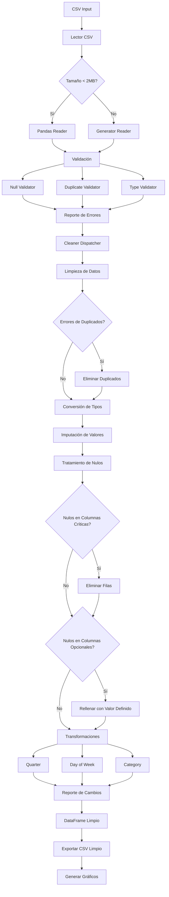

# ProyectoEquipo5

# Proyecto Clean CSV

## Descripción del proyecto

**Proyecto Clean CSV** consiste en un pipeline de lectura, procesamiento y reporte de un fichero CSV que incluye validación, limpieza y transformación de datos. Está diseñado para manejar archivos CSV de cualquier tamaño

### Características Principales

**Arquitectura**
- Selección automática de tipo de lectura del archivo según su tamaño
- Sistema de logging detallado
- Configuración externa mediante JSON
- Testing

**Validación**
- Detección de valores nulos
- Identificación de registros duplicados
- Verificación de tipos de datos

**Limpieza**
- Eliminación de duplicados configurable
- Imputación de valores numéricos basados en relaciones matemáticas entre columnas
- Relleno de valores nulos según estrategia definida
- Conversión automática de tipos de datos

**Transformaciones**
- Cálculo del trimistre anual en base a la fecha
- Cálculo del dia de la semana en que se produce la venta
- Clasificación por categoría de los productos vendidos

**Reportes y exportaciones**
- Exportación de CSV limpio
- Generación de gráficos de estadísticas de ventas
- Registro de cambios aplicados durante la limpieza

---

## Arquitectura del Proyecto

```
proyecto_clean_csv/
├── main.py                          # Punto de entrada que llama al orquestador
├── schema_generator.py              # Fichero que genera un esquema de la arquitectura del proyecto
├── pyproject.toml                   # Configuración del proyecto y dependencias
├── examples/                        # Archivos CSV de ejemplo
│   ├── retail_store_sales.csv
│   └── ventas_cafe.csv
├── generated/                       # Carpeta donde se guardan los archivos generados por el pipeline
│   ├── plots/                       # Carpeta para los gráficos generados
├── src/module/
│   ├── cleaners/                    # Módulo de limpieza de datos
│   │   ├── cleaners.py              # Funciones de limpieza
│   │   └── cleaner_dispatcher.py    # Dispatcher para aplicar limpiezas
│   ├── data_models/
│   │   ├── config.json              # Configuración de limpieza
│   │   └── schema.py                # Definición de esquema y constantes
│   ├── pipelines/
│   │   └── orchestrator.py          # Orquestador principal del pipeline
│   ├── read/                        # Módulo de lectura de archivos
│   │   ├── csv_reader_selector.py   # Selector de estrategia de lectura en base al tamaño del archivo
│   │   └── reader.py                # Implementación de los distintos lectores
│   ├── reports/                     # Sistema de reportes y logging
│   │   ├── decorators.py            # Decoradores para tracking
│   │   ├── logging_config.py        # Configuración de logging
│   │   ├── clean_csv_exporter.py    # Función para exportar CSV limpio
│   │   ├── plot_generator.py        # Funciones para generar gráficos
│   │   └── app_log.txt              # Fichero de logs
│   ├── transforms/                  # Transformaciones de datos
│   │   ├── item.py                  # Cálculo de categoría del producto en una nueva columna
│   │   ├── weekday.py               # Cálculo del día de la semana en base a la fecha
│   │   └── year_third.py            # Cálculo del trimestre anual en base a la fecha
│   └── validators/                  # Validadores de datos
│       ├── base_validator.py        # Definicion del protocolo de validación
│       └── specific_validators.py   # Validadores específicos que implementan el protocolo
└── tests/                           # Carpeta en la que se encuentran los tests del proyecto
    └── test_validators.py
```

---

## Flujo del Pipeline



---

### Dependencias

**Principales:**
- python >= 3.11
- pandas >= 3.0.0
- matplotlib>=3.10.8

**Desarrollo:**
- pytest >= 9.0.2
- pytest-cov >= 7.0.0
- ruff >= 0.15.1

---

## Uso

### Ejecución Básica

```bash
python main.py
```

El script ejecutará el pipeline sobre el archivo configurado en `main.py` (por defecto `examples/ventas_cafe.csv`).

## Configuración

El archivo `src/module/data_models/config.json` permite configurar el comportamiento del pipeline:

```json
{
    "duplicates": {
        "apply": true,
        "keep": "last",
        "columns": ["Transaction ID"]
    },
    "nulls": {
        "apply": true,
        "fill_value": "NO_PROPORCIONADO",
        "columns": ["Category", "Payment Method"]
    }
}
```

### Parámetros de Configuración

#### Duplicados (`duplicates`)
- `apply` (bool): Activar/desactivar eliminación de duplicados
- `keep` (str): Estrategia para mantener duplicados
  - `"first"`: Mantener primera ocurrencia
  - `"last"`: Mantener última ocurrencia
  - `false`: Eliminar todas las ocurrencias
- `columns` (list): Columnas para identificar duplicados

#### Valores Nulos (`nulls`)
- `apply` (bool): Activar/desactivar manejo de nulos
- `fill_value` (any): Valor para rellenar nulos
- `columns` (list): Columnas donde aplicar el relleno

---

## Esquema de Datos

El proyecto maneja datos con el siguiente esquema (definido en `schema.py`):

| Columna            | Tipo     | Nullable | Descripción                    |
|--------------------|----------|---------|---------------------------------|
| Transaction ID     | str      | No      | Identificador único             |
| Item               | str      | No      | Producto vendido                |
| Quantity           | int      | No      | Cantidad de unidades            |
| Price Per Unit     | float    | No      | Precio unitario                 |
| Total Spent        | float    | No      | Importe total de la transacción |      
| Payment Method     | str      | Si      | Método de pago                  |
| Location           | str      | Si      | Para tomar o para llevar        |
| Transaction Date   | datetime | No      | Fecha de la transacción         |

**Columnas No Nullables**: Si contienen valores nulos después de la imputación, se eliminan las filas completas.

**Columnas Opcionales**: Los valores nulos se rellenan con el valor configurado.

---

### Estructura de Tests

El proyecto incluye tests para:
- Validadores (NULL_VALUES, DUPLICATED_VALUES, TYPE_ERROR)
- 
- 

---

## Funcionalidades

### 1. Lectura de CSV
Se selecciona automáticamente la implementación de lectura según el tamaño del archivo:
- **< 2 MB**: Se utiliza ReaderCSVPandas para cargar el archivo completo en memoria.
- **≥ 2 MB**: Se utiliza ReaderCSVGenerator, que lee fila a fila el archivo y luego construye el DataFrame.


### 2. Validación de Datos

#### - NullValidator
Detecta si hay valores nulos en cualquier columna del DataFrame y, en caso de haber, devuelve un diccionario con las columnas que contienen nulos y el tipo de error NULL_VALUES_ERROR.

#### - DuplicateValidator
Identifica registros duplicados basándose en la columna `Transaction ID` y, en caso de haber, lo indica en el diccionario de errores con el tipo DUPLICATED_VALUES_ERROR.

#### - TypeValidator
Verifica que las columnas tengan los tipos de datos correctos según el esquema. Las columnas que no cumplen con el tipo esperado se reportan en el diccionario de errores con el tipo TYPE_ERROR.


### 3. Limpieza de Datos

#### Eliminación de Duplicados


#### Conversión de tipos de datos


#### Imputación de valores numéricos basados en relaciones matemáticas entre columnas


#### Manejo de Valores Nulos


### 4. Transformaciones y cálculos de nuevas columnas

#### Columna "Quarter"


#### Columna "Weekday"


#### Columna "Category"


### 5. Exportación
- Se exporta un nuevo archivo CSV limpio con las transformaciones aplicadas.
- Crea diferentes gráficos de barras para ver diferentes estadísticas de las ventas.


### 6. Sistema de Logging
- Se genera un reporte detallado de los errores encontrados durante la validación, indicando el tipo de error y las columnas afectadas.

---
## Herramientas de calidad de código

El proyecto utiliza la herramienta **Ruff** para asegurar la calidad del código, siguiendo los siguientes estándares:

- pycodestyle (errores y warnings)
- pyflakes
- isort
- pep8-naming
- pyupgrade
- Longitud máxima de línea: 100 caracteres
